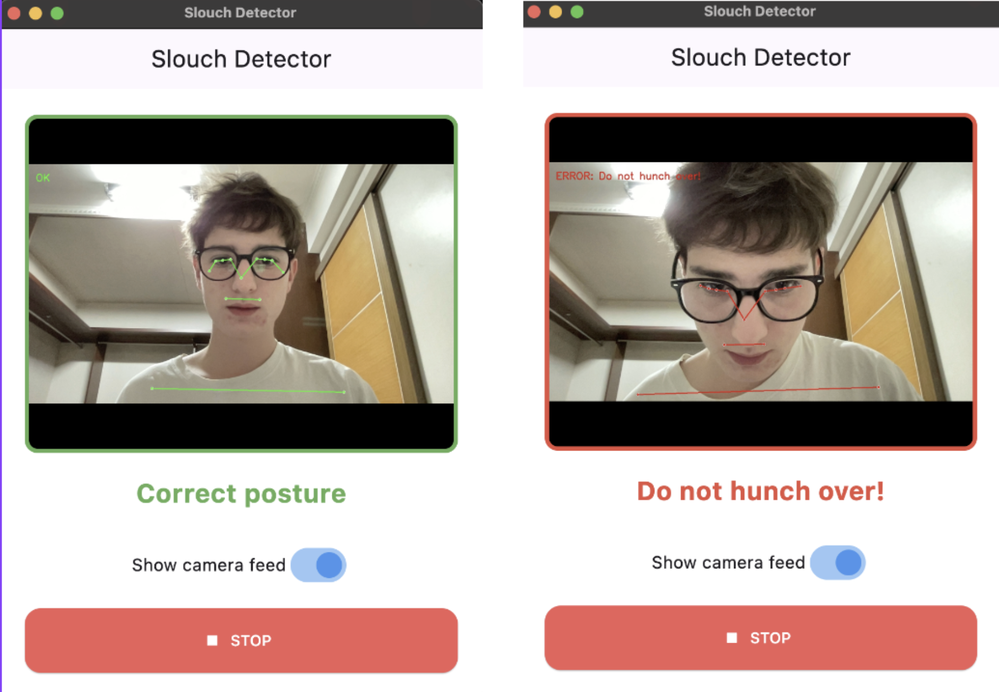

# Slouch Detector 
## Preview:



Welcome to the **Slouch Detector** project! This application uses your computer's camera to detect if you are slouching and reminds you to sit up straight sending you a notification.

It consists of two parts:
1.  **Flutter App**: The user interface (Desktop App).
2.  **Python Backend**: The logic that analyzes your posture using MediaPipe.

---

## Prerequisites

Before you start, make sure you have the following installed:

1.  **Flutter SDK**: [Install Flutter](https://docs.flutter.dev/get-started/install)
2.  **Python 3.x**: [Install Python](https://www.python.org/downloads/)

---

##  Installation Guide

### 1. Clone the Repository
Open your terminal and run the following command to clone the project locally:

```bash

git clone https://github.com/Luca-Fregona/CS_project.git
cd CS_project
git checkout app-test
```

Once the download is complete, navigate to the project folder:

```bash

cd slouchdetector
```

### 2. Setup Python Backend
The app needs a Python environment to run.

**MacOS / Linux:**
```bash
cd python_backend
python3 -m venv venv
source venv/bin/activate
pip install -r requirements.txt
cd ..
```

**Windows:**
```powershell
cd python_backend
python -m venv venv
.\venv\Scripts\activate
pip install -r requirements.txt
cd ..
```

### 3. Setup Flutter App
Install the necessary Flutter packages:
```bash
flutter pub get
```

---

## ▶ How to Run the App

You can run the app directly from your terminal or IDE.

### MacOS
```bash
flutter run -d macos
```

### Windows
```bash
flutter run -d windows
```

### Linux
```bash
flutter run -d linux
```

---
